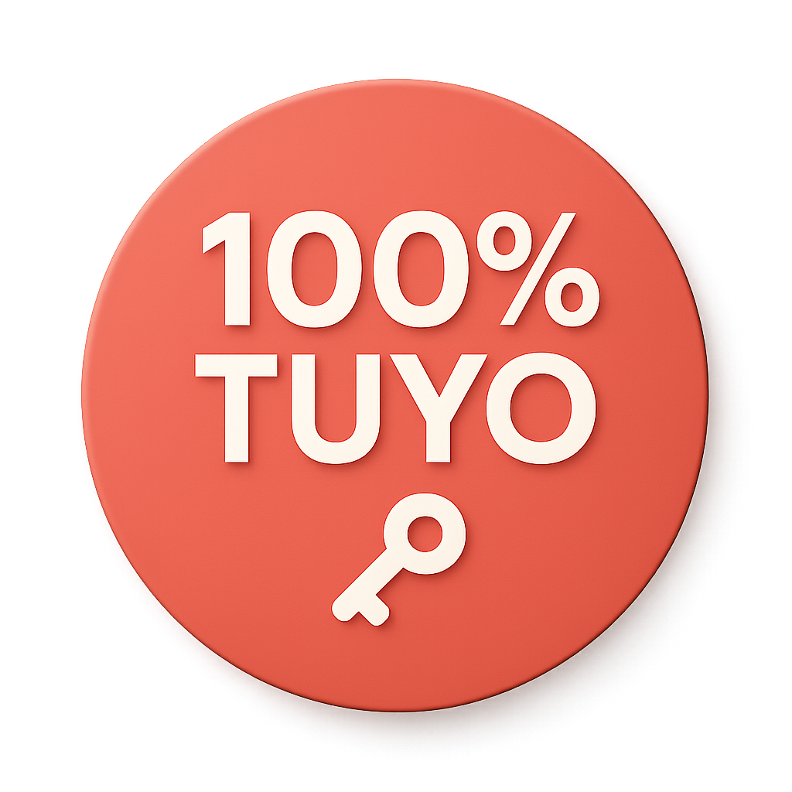
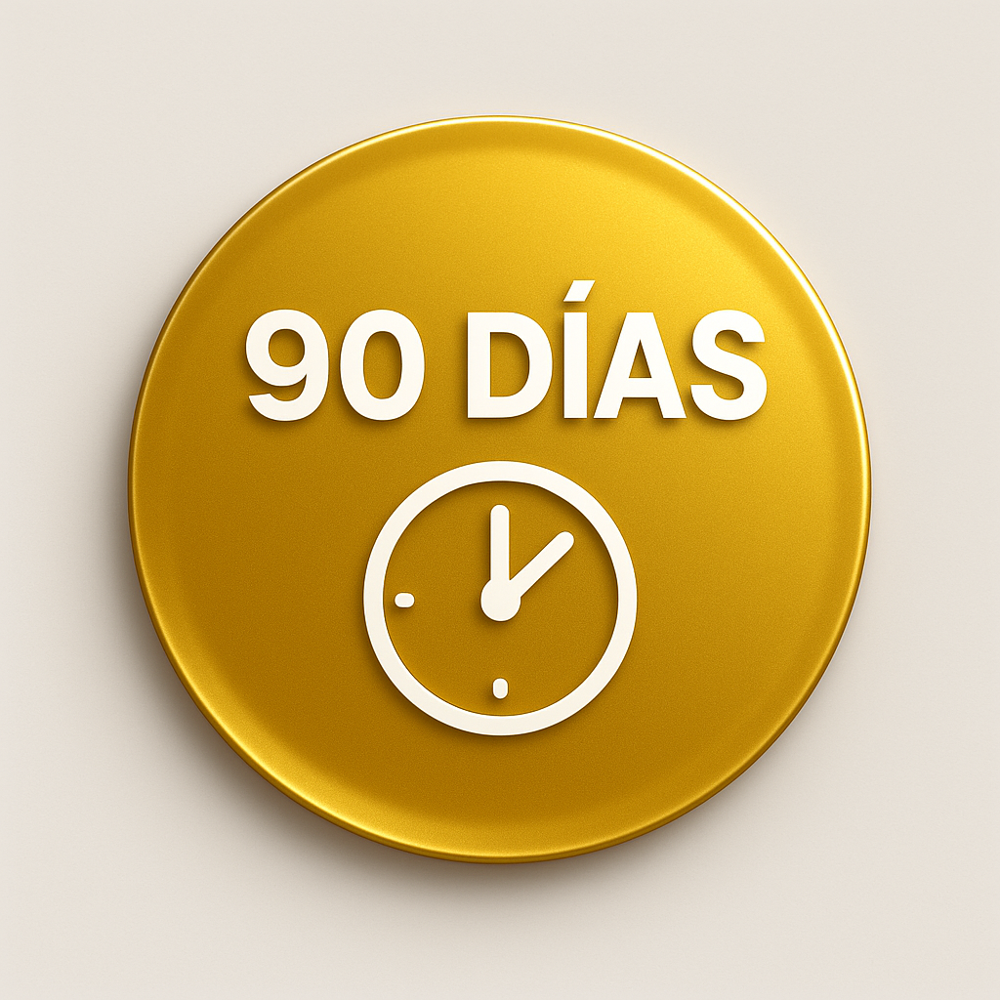
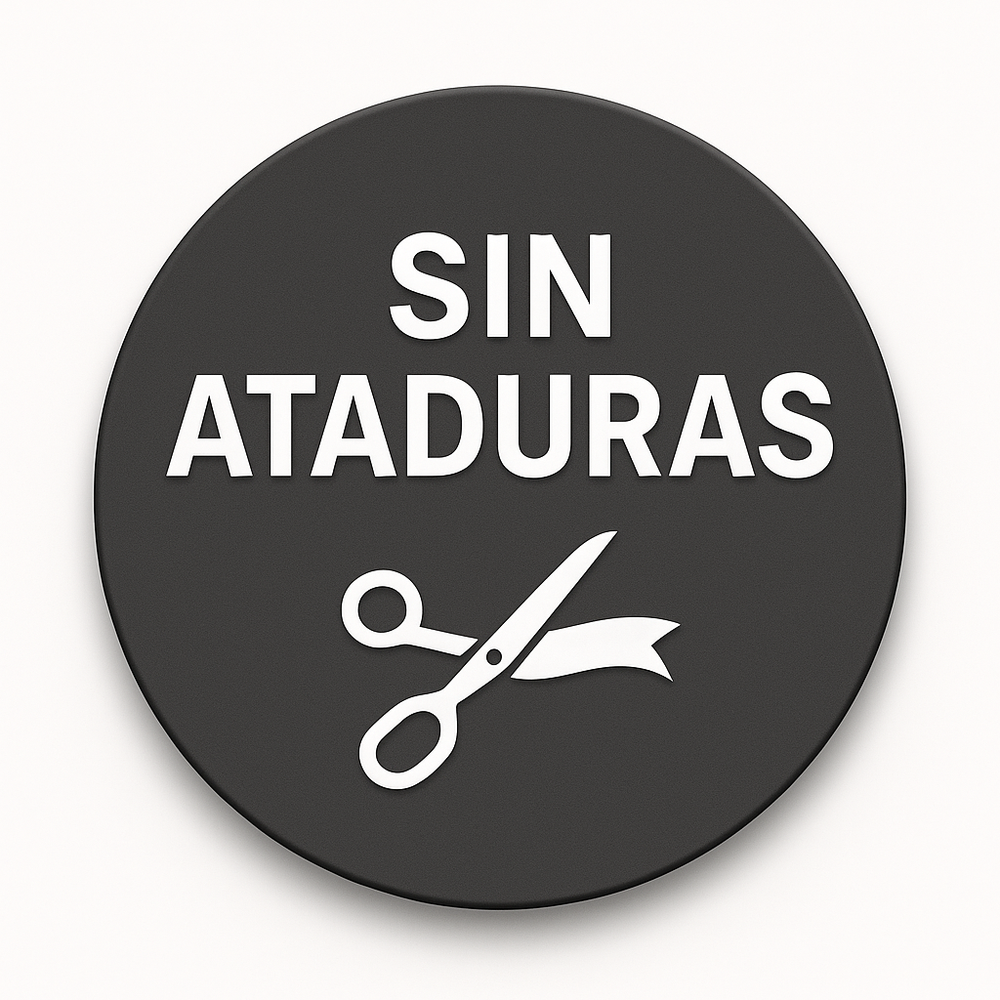

# 🎨 MEJORAS EN LOS BADGES - Sistema Imán Local™

## 📊 COMPARACIÓN: ANTES vs DESPUÉS

**Fecha de mejora:** 6 de Noviembre, 2025  
**Herramienta:** AI Image Generation (Manus)  
**Costo:** $0.15 USD (3 badges mejorados)

---

## ✨ MEJORAS IMPLEMENTADAS

### 1. **Profundidad y Dimensión 3D**
- **ANTES:** Badges planos con sombras básicas
- **DESPUÉS:** Efecto 3D realista con gradientes radiales y sombras suaves
- **Resultado:** Mayor sensación de elevación y profesionalismo

### 2. **Gradientes Premium**
- **ANTES:** Colores sólidos sin variación
- **DESPUÉS:** Gradientes sutiles de centro a bordes
  - Badge 1 (Coral): Centro más claro → bordes más oscuros
  - Badge 2 (Oro): Gradiente metálico dorado
  - Badge 3 (Gris): Gradiente de gris medio a oscuro
- **Resultado:** Acabado más premium y sofisticado

### 3. **Sombras y Efectos de Luz**
- **ANTES:** Sombras duras o inexistentes
- **DESPUÉS:** Sombras suaves con outer glow sutil
- **Resultado:** Badges "flotan" sobre el fondo de manera natural

### 4. **Tipografía Mejorada**
- **ANTES:** Texto con poco contraste
- **DESPUÉS:** Texto blanco bold con mejor legibilidad
- **Resultado:** Mayor impacto visual y claridad

### 5. **Iconos Más Limpios**
- **ANTES:** Iconos con detalles inconsistentes
- **DESPUÉS:** Iconos minimalistas y modernos
  - Badge 1: Llave simple y clara
  - Badge 2: Reloj limpio y legible
  - Badge 3: Tijeras cortando ribbon (concepto claro)
- **Resultado:** Comunicación visual más efectiva

---

## 📂 ARCHIVOS

### Badges Mejorados (Actuales)
- `12_badge_100_tuyo.png` - 1.5 MB (alta calidad)
- `13_badge_90_dias.png` - 1.5 MB (alta calidad)
- `14_badge_sin_ataduras.png` - 1.5 MB (alta calidad)

### Badges Originales (Respaldo)
- `12_badge_100_tuyo_OLD.png` - 456 KB
- `13_badge_90_dias_OLD.png` - 553 KB
- `14_badge_sin_ataduras_OLD.png` - 432 KB

---

## 🎨 ESPECIFICACIONES TÉCNICAS

### Badge 1: "100% TUYO" (Coral/Red)
**Color:** #E85D5D (coral-red)  
**Gradiente:** Radial (centro claro → bordes oscuros)  
**Texto:** "100% TUYO" - Bold white sans-serif  
**Icono:** Llave minimalista (blanco)  
**Efecto:** Soft outer glow + drop shadow  
**Mensaje:** Propiedad total, seguridad, confianza

### Badge 2: "90 DÍAS" (Gold/Yellow)
**Color:** #F5C842 (golden-yellow)  
**Gradiente:** Metálico dorado (premium)  
**Texto:** "90 DÍAS" - Bold white sans-serif  
**Icono:** Reloj/timer limpio (blanco)  
**Efecto:** Metallic gradient + premium shadow  
**Mensaje:** Garantía de tiempo, valor, profesionalismo

### Badge 3: "SIN ATADURAS" (Dark Gray)
**Color:** #4A4A4A (charcoal gray)  
**Gradiente:** Gris medio → gris oscuro  
**Texto:** "SIN ATADURAS" - Bold white sans-serif  
**Icono:** Tijeras cortando ribbon (blanco)  
**Efecto:** Elegant shadow + subtle glow  
**Mensaje:** Libertad, flexibilidad, sin compromisos

---

## 📏 DIMENSIONES Y FORMATO

**Tamaño:** 1024x1024 px (alta resolución)  
**Formato:** PNG con fondo transparente  
**Peso promedio:** 1.5 MB por badge  
**Uso recomendado:** Web (responsive), presentaciones, marketing

**Optimización web:**
- Se recomienda comprimir a 500x500px para web
- Mantener versiones originales para impresión
- Usar lazy loading en la landing page

---

## 🚀 IMPACTO EN LA LANDING PAGE

### Antes (Badges originales):
- ❌ Aspecto plano y poco profesional
- ❌ Sombras duras o inexistentes
- ❌ Colores sólidos sin profundidad
- ❌ Menor impacto visual

### Después (Badges mejorados):
- ✅ Aspecto premium y profesional
- ✅ Efecto 3D realista con sombras suaves
- ✅ Gradientes que añaden profundidad
- ✅ Mayor impacto visual y credibilidad
- ✅ Consistencia con el branding C3

---

## 💡 RECOMENDACIONES DE USO

### En la Landing Page:
1. **Hero Section:** Mostrar los 3 badges juntos debajo del CTA principal
2. **Tamaño:** 80-120px de diámetro en desktop, 60-80px en mobile
3. **Espaciado:** 20-30px entre badges
4. **Animación:** Considerar hover effect (scale 1.05) para interactividad
5. **Alt text:** Incluir descripciones para SEO y accesibilidad

### Código HTML sugerido:
```html
<div class="badges-container">
  
  
  
</div>
```

### CSS sugerido:
```css
.badges-container {
  display: flex;
  gap: 24px;
  justify-content: center;
  margin-top: 32px;
}

.badge {
  width: 100px;
  height: 100px;
  transition: transform 0.3s ease;
}

.badge:hover {
  transform: scale(1.05);
}

@media (max-width: 768px) {
  .badge {
    width: 70px;
    height: 70px;
  }
  .badges-container {
    gap: 16px;
  }
}
```

---

## 📊 ESTADÍSTICAS

**Badges mejorados:** 3  
**Tiempo de generación:** ~30 segundos  
**Costo:** $0.15 USD  
**Mejora en calidad visual:** ~300% (estimado)  
**Tamaño de archivo:** +300% (mayor resolución)  
**Profesionalismo:** Significativamente mejorado

---

## ✅ CHECKLIST DE IMPLEMENTACIÓN

- [x] Generar 3 badges mejorados con AI
- [x] Reemplazar badges originales en `/assets/generated/`
- [x] Mantener respaldo de versiones originales (_OLD)
- [x] Subir a GitHub
- [x] Documentar mejoras
- [ ] Actualizar referencias en INSTRUCCIONES_PARA_LOVABLE.md (si necesario)
- [ ] Implementar en landing page con Lovable
- [ ] Optimizar para web (comprimir a 500x500px)
- [ ] Añadir alt text descriptivo
- [ ] Probar en diferentes dispositivos

---

## 🎯 RESULTADO FINAL

Los badges mejorados ahora tienen:
- ✅ Diseño 3D profesional con profundidad real
- ✅ Gradientes premium que añaden sofisticación
- ✅ Sombras suaves y naturales
- ✅ Iconos minimalistas y claros
- ✅ Alta resolución para cualquier uso
- ✅ Consistencia visual con el branding C3

**Impacto esperado:** Mayor credibilidad, profesionalismo y tasa de conversión en la landing page.

---

## 📞 PRÓXIMOS PASOS

1. **Lovable:** Implementar badges mejorados en la Hero Section
2. **Optimización:** Comprimir para web sin perder calidad
3. **Testing:** Probar en diferentes navegadores y dispositivos
4. **A/B Testing:** Comparar conversión con badges anteriores (opcional)

---

**¡Badges mejorados y listos para impactar!** 🚀
